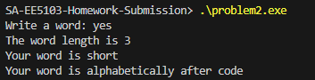
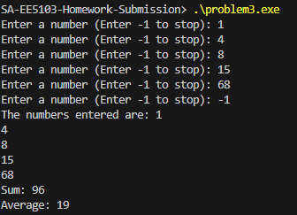
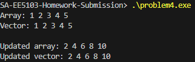
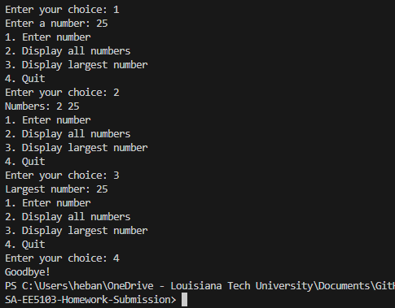

# UTSA-EE5103-Homework-Submission
Submission for Engineering programming Homework (C++)

Name: Hebane Guehi
Course: EE5103 (Engineering Programming)
Homework 1
Instructions: I used VScode with gcc as compiler.

# Problem 1

The code promts the user to enter three integer temperatures and calculates their average by adding them and dividing by 3.0 to ensure decimal division. It then prints the average temperature and uses conditional statements to classify the result as cold (below 50), moderate (between 50 and 80), or hot (above 80).

# Problem 2

The user is asked to enter a single word and stores it in a string. It calculates the length of the word using .length()and prints it. Then, using conditional statements, it classifies the word as short (4 characters or fewer), medium (5–8 characters), or long (9 or more characters). Finally, it compares the word alphabetically to "code", using string comparison operators to determine whether it comes before or after "code".
I learned how to find the length of a word using.length from chatgpt. I could not find it in the lecture notes.

# Problem 3

The user enters integers and stores them in a vector. The input stops when the user enters -1 and is not stored. After the input ends, the program prints all the numbers entered, calculates their total sum using a loop, and computes the average of elements in the vector.

# Problem 4

The solution stores five integers in both an array and a vector, then prints their original values ​​using loops and indexing. After that, it doubles each element in both containers and prints the updated results.

# Problem 5

The code repeatedly displays a menu until the user chooses to quit. The user can enter numbers (which are stored in the vector), display all stored numbers, or find and display the largest number by comparing elements in a loop. The program continues running until option 4 is selected.