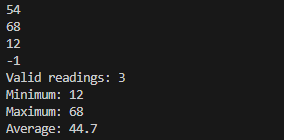
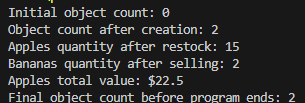
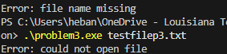
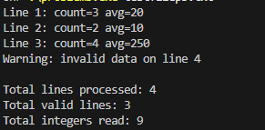
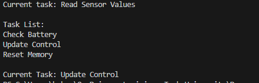
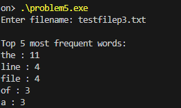

# UTSA-EE5103-Homework-Submission
Submission for Engineering programming Homework (C++)

Name: Hebane Guehi
Course: EE5103 (Engineering Programming)
Homework 1
Instructions: I used VScode with gcc as compiler.

# Problem 1

The program repeatedly reads integer sensor values ​​from the user until the sentinel value -1 is entered. For each value, it checks whether the reading falls within the valid range of 0 to 500; if so, it updates the count of valid readings, adjusts the running minimum and maximum, and adds the value to the cumulative sum. After input ends, the program computes the average as sum divided by count. If no valid readings were entered, it outputs “No valid data.” Otherwise, it prints the number of valid readings, the minimum and maximum values, and the average formatted to one decimal place.

# Problem 2

The program defines a class called InventoryItemthat represents an item in an inventory. Each object stores the item's name, quantity, and unit price. The class includes constructors to initialize these values ​​and a static variable that keeps track of how many inventory objects currently exist. Member functions allow the program to restock items, sell items, and calculate the total value of the inventory based on quantity and price. In the mainfunction, several InventoryItemobjects are created to demonstrate restocking, selling, computing total value, and displaying the number of objects created using the static counter.

# Problem 3

The program reads a filename from the command line and attempts to open the file using std::ifstream. It then processes the file line by line using std::getline. For each line, a helper function uses std::istringstreamto extract integers and store them in a std::vector. If a line contains non-numeric data, the program prints a warning and skips that line. For valid lines, it calculates the number of integers and their average, then prints the results for that line. After processing the entire file, the program prints a final summary showing the total number of lines processed, the number of valid lines, and the total number of integers read

# Problem 4

First, 3 tasks are added to the list, and an iterator is set to point to the current task. The program then inserts a new task after the current one and removes the current task to show how list operations work. After updating the iterator to the next task, the program prints the entire task list and displays the task that is currently selected. The example highlights how std::list allows safe insertion and deletion without affecting other iterators in the container.

# Problem 5

The program prompts the user to enter the name of a text file and reads the file line by line using std::ifstream. Each line is processed with std::istringstreamto extract individual words. The program uses a std::map<std::string, int>to keep track of how many times each word appears in the file by incrementing the count whenever a word is encountered. Helper functions are used to process each line and to determine the most frequent words. After the entire file is read, the program sorts the word counts and prints the five most frequently occurring words along with the number of times they appear.
