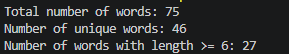
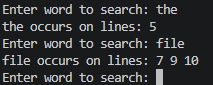

# UTSA-EE5103-Homework-Submission
Submission for Engineering programming Homework (C++)

Name: Hebane Guehi
Course: EE5103 (Engineering Programming)
Homework 1
Instructions: I used VScode with gcc as compiler.

# Problem 1

The program uses C++ generic algorithms to process text without manual loops. It reads words into a vector using stream iterators, then normalizes them with std::transform by converting to lowercase and removing punctuation. Empty words are removed with std::remove_if, and std::count_if is used to count words of length ≥ 6. The words are then sorted with std::sort, and duplicates are removed using std::unique followed by erase, after which the required statistics are printed.

# Problem 2

The program reads the file line by line and builds a word index using a std::map whose key is a word and whose value is a std::set of line numbers. Each word is normalized by removing punctuation and converting letters to lowercase before being stored. As each line is processed, the current line number is inserted into the set for that word, which automatically avoids duplicate line numbers. After the file is processed, the user can repeatedly search for a word, and the program uses map::find to display all line numbers where that word appears

# Problem 3

# Problem 4

