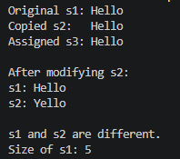
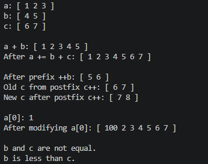
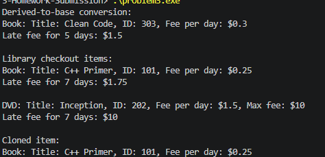
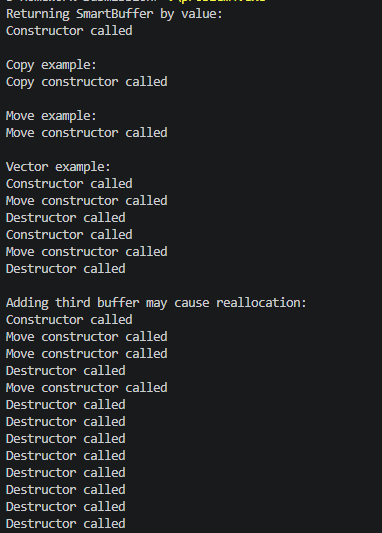

# UTSA-EE5103-Homework-Submission
Submission for Engineering programming Homework (C++)

Name: Hebane Guehi
Course: EE5103 (Engineering Programming)
Homework 4
Instructions: I used VScode with gcc as compiler.

# Problem 1

The SimpleString class implements value-like behavior by managing a dynamically allocated character array (char*) and following the Rule of Three. It defines a copy constructor and copy-assignment operator that perform deep copies, ensuring each object has its own independent memory, and a destructor that properly frees this memory to avoid leaks. By overloading operators such as <<, ==, !=, and [], the class behaves similarly to built-in types and standard strings. As a result, copying or assigning objects does not create shared ownership, so modifying one instance does not affect others.

# Problem 2

NumberList manages a dynamically allocated integer array, so it follows the Rule of Three by defining a copy constructor, copy-assignment operator, and destructor. The copy operations perform deep copies so each list owns its own memory, while the destructor releases the array with delete[]. The overloaded + and += concatenate lists, == checks element-by-element equality, < uses lexicographical comparison, [] provides indexed access, and prefix/postfix ++ increment all elements. Returning references from += and prefix ++ allows chaining and efficient modification.

# Problem 3

This solution uses an abstract base class, LibraryItem, to define a common interface for all library items. The pure virtual functions lateFee() and clone() make the class abstract, while the virtual destructor ensures proper cleanup through base-class pointers. Book and DVD inherit publicly from LibraryItem and override the virtual functions with their own late-fee rules. Objects are stored in a std::vector<LibraryItem*>, which prevents slicing and allows dynamic binding, so the correct derived-class version of lateFee() and print() runs at runtime. Finally, all dynamically allocated objects are deleted to avoid memory leaks.

# Problem 4

SmartBuffer manages a dynamically allocated integer array, so it implements copy control and move control. The copy constructor and copy-assignment operator allocate new memory and copy the contents, while the move constructor and move-assignment operator simply transfer ownership of the array pointer from one object to another. After moving, the source object is reset to nullptr and size 0, making it safe to destroy. The noexcept keyword helps std::vector choose move operations instead of copy operations during reallocation.